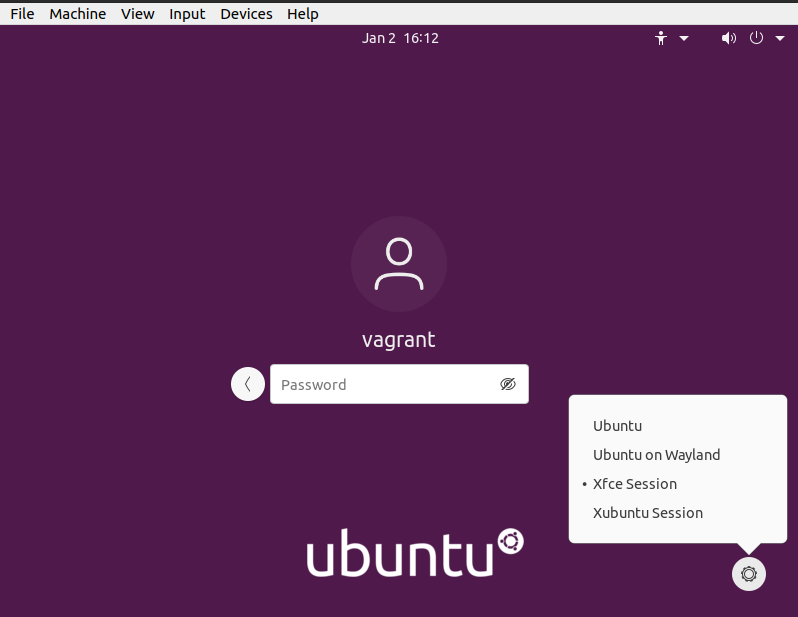

# Vagrant Box For DevSecOps Course - Ubuntu 20.04

## 1- Specifications

- ***Operating System***: Ubuntu 20.04.3

- ***Architecture***: AMD64

- ***Virtualisation Provider***: Virtualbox 6.1

##  2-  Component

- Ubuntu GUI (Gnome, XFCE4)

- Docker

- Docker Compose

- Ansible

- Atom Editor

- AWS Tools

- OpenJDK 17 (JDK + JRE)

- Maven (3.8.4)

- Jenkins

- MySQL + phpMyAdmin

- Teamviewer

- Terraform

- Labtainer


##  3-  Installation

### Pre-requisites

1.  Install Virtualbox, please follow the instructions based on your computer's operating system.
  [https://www.virtualbox.org/wiki/Downloads](https://www.virtualbox.org/wiki/Downloads)

1.  (Restart might be needed) Install Vagrant, please follow the instructions based on your computer's operating system.
  [https://www.vagrantup.com/docs/installation](https://www.vagrantup.com/docs/installation)

### Retrieving & Configuring the Vagrant Box
1.  Open a Command Shell on your computer.

1.  Make sure that vagrant is working on your computer:
  ```bash
  vagrant -v
  ```

1.  Clone this repository on your host machine:
```bash
git clone https://github.com/oabuoun/devsecops_vm.git
```

1.  cd into the folder
```bash
cd devsecops_vm
```

1.  (Optional) Edit the file ***Vagrantfile*** to choose the CPU cores and amount of memory you want to assign for the Virtual Machine that will be created.

  These are the default values, you can change them based on the resources you have on your machine.

  ```bash
  vb.memory = "4096"
  vb.cpus = 4
  ```

1.  Vagrant will share your current directory with the virtual machine on ***/vagrant***

1.  The following line in the configuration will also share your current Home directory with the Virtual Machine on ***/home/vagrant/host***

  ```bash
  config.vm.synced_folder "#{Dir.home}", "/home/vagrant/host", type: "virtualbox"
  ```

### Starting the Vagrant Box
1.  Start Vagrant, the following command will download the Box from the vagrant hub (about 9.0 GB):
  ```bash
  vagrant up
  ```

1.  When Vagrant finishes downloading the file, it will create the Virtual Machine and start configuring it.

  It's recommended to wait for all configuration to be done before start working with the Virtual machine.

### Logging into the Virtual Machine

####  GUI
  - Default GUI: Gnome, this GUI might be slow on some computers based on the resources given to the virtual machine.
  It's recommended to use another GUI (xfce4 which is already installed) by choosing it BEFORE logging into the machine

    <p align="center">
    	<a href="assets/ubuntu-xfce4-01.png">
    	 
    	</a>
    	<a href="https://media.geeksforgeeks.org/wp-content/uploads/20200105215737/Untitled-Diagram-215-1.jpg">
        <br/>
        <sub><sup>
          https://media.geeksforgeeks.org/wp-content/uploads/20200105215737/Untitled-Diagram-215-1.jpg
        </sup></sub>
      </a>

    </p>

    - Default Credentials:
      ```bash
      Username: vagrant
      Password: vagrant
      ```

#### Vagrant CLI Operations:

- Starting a shell from your host computer in the Virtual machine
  ```bash
  vagrant ssh
  ```

  to end the session:
  ```bash
  exit
  ```

- Stopping the Virtual machine
  ```bash
  vagrant halt
  ```

- Restarting the Virtual machine
  ```bash
  vagrant reload
  ```

- Deleting the Virtual machine (Will delete the virtual machine and all data stored in it, data in shared folders will not be affected)
  ```bash
  vagrant destroy
  ```

- Updating the Box version
  ```bash
  vagrant box update
  ```
